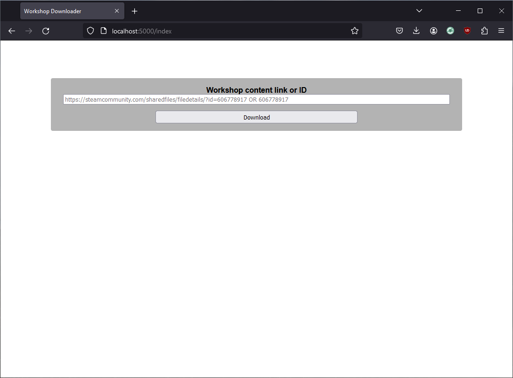
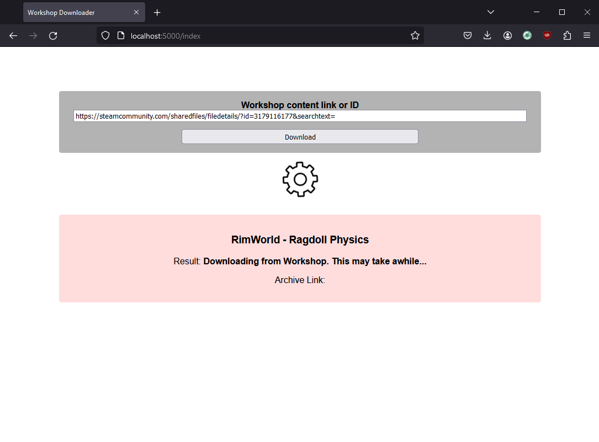
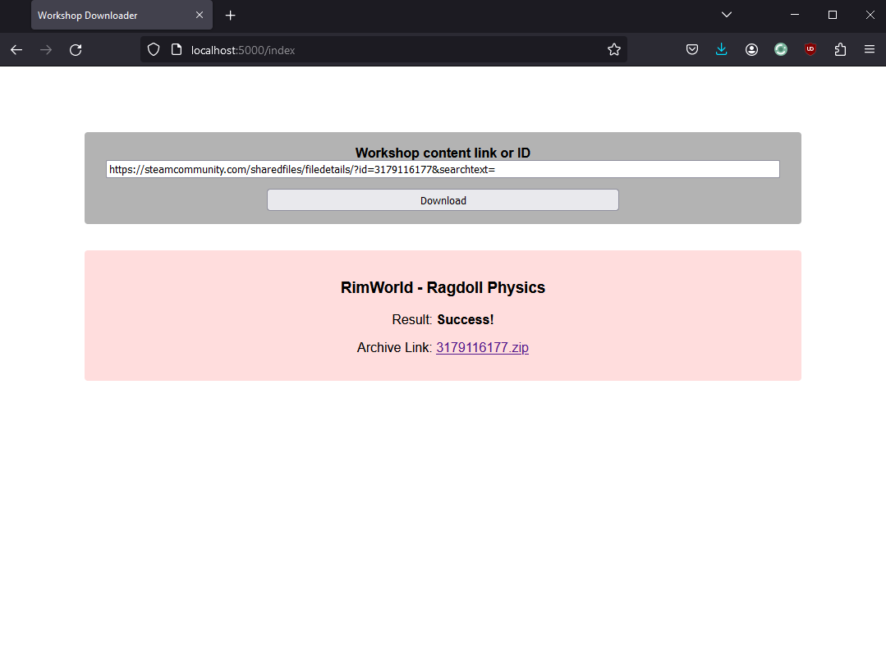

# Workshop Downloader

This tool provides a *super* simple WebUI for downloading steam workshop content.

The content is archived in ZIP format for easy download, and automatically deleted from the server after an hour.

## Requirements

- Python 3, Tested on 3.11
  - flask
  - requests
- SteamCMD executable available via terminal command `steamcmd`.

## Setup

For python dependencies run `pip install -r requirements.txt`

For SteamCMD, download the executable by following instructions from [Valve](https://developer.valvesoftware.com/wiki/SteamCMD). Either add SteamCMD to your PATH variable, or place it in the same directory as the source code.

## Usage

You can use the `flask` command or run the server as a normal python script.

`flask run` or `python app.py`

For development or information, API documentation is located [here](API.md).

> It is recommended to only listen on localhost/local network. This is not designed to be an external facing service.

## Screenshots

> Index page

> Downloading and Compressing

> Finished and available

